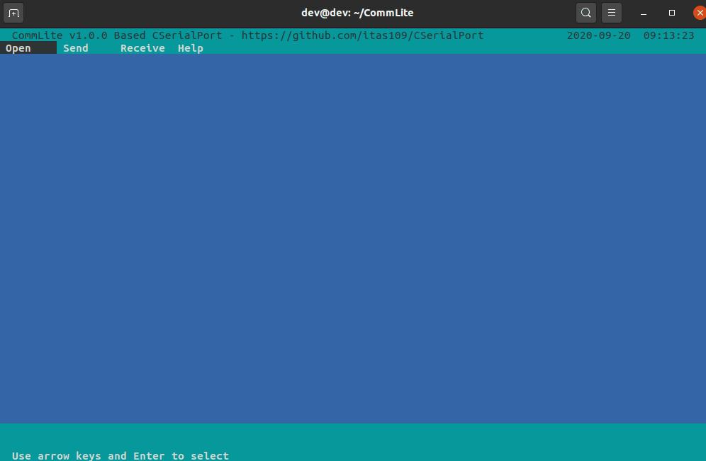

CommLite

Language: <strong>English</strong> / <a href="README.md">Chinese 中文</a>

---

CommLite is tui's serial port tool based CSerialPort

* support x86, arm, mips cpu architecture
* support windows dos, linux, macos,raspberrypi, freebsd operating system

