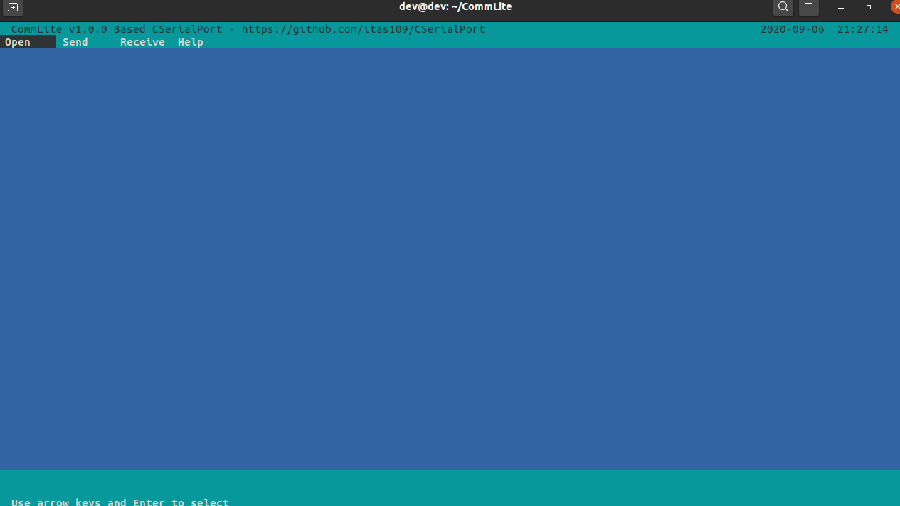

<p align="center">CommLite</p>

<p align="center">
<a href="https://github.com/itas109/CommLite/releases"></a>
<a href="https://github.com/itas109/CommLite/stargazers"></a>
<a href="https://github.com/itas109/CommLite/network/members"></a>
<a href="https://github.com/itas109/CommLite/blob/master/LICENSE"></a>


</p>

<p align="center">
语言：<a href="README-EN.md">English</a> / <strong>中文</strong>
</p>

---

CommLite是一款基于CSerialPort的文本UI串口调试助手

# Platform 平台
CommLite已经在以下平台做过测试:

   - DOS ( x86_64 )
   - Windows ( x86_64 )
   - Linux ( x86_64, aarch64, mips64el, sw_64, s390x, ppc64le )
   - macOS ( x86_64 )
   - Raspberry Pi ( armv7l )
   - FreeBSD ( x86_64 )
   - ...

# Quick Start 快速开始

```
$ git clone --depth=1 https://github.com/itas109/CommLite.git
$ cd CommLite
$ mkdir bin && cd bin
$ cmake ..
$ cmake --build .
$ ./commlite
```
linux打包 deb
```
$ cd bin
$ cpack .
```
ubuntu 20.04 交叉编译 aarch64/arm/mips64el
```
$ sudo apt-get install g++-aarch64-linux-gnu
$ ./cmake_build_aarch64.sh

$ sudo apt-get install g++-arm-linux-gnueabi
$ ./cmake_build_arm.sh

$ sudo apt-get install g++-mips64el-linux-gnuabi64
$ ./cmake_build_mips64el.sh
```

# Screenshot 截图



# Contacting 联系方式

* Email : itas109@qq.com

* QQ群 : [129518033](http://shang.qq.com/wpa/qunwpa?idkey=2888fa15c4513e6bfb9347052f36e437d919b2377161862948b2a49576679fc6)

# Donate 捐助

[CSDN博客](https://blog.csdn.net/itas109)

# License 开源协议

[GNU Lesser General Public License v3.0](LICENSE)